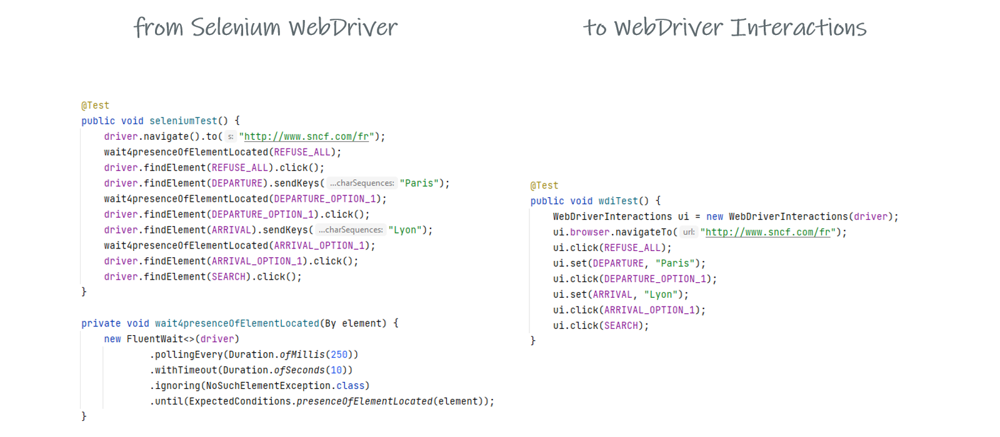

# Simple for Tests
*simple4tests aims to provide methodology and simple tools to support developers and testers while building maintainable
and reliable automated tests*

## WebDriver Interactions
Package *interactions-webdriver* is a set of functions you can integrate in your selenium test automation framework to manage
automaticaly several technical stuff like waits, scrolling and much more.

**You have less to care about it, keeping the code clean and focused on the test purpose**

For more information, see [the WebDriver Interactions documentation](https://simple4tests.github.io/webdriver/interactions.html)

### Support and Contact
Having trouble or questions? Contact us at simple4tests@gmail.com
